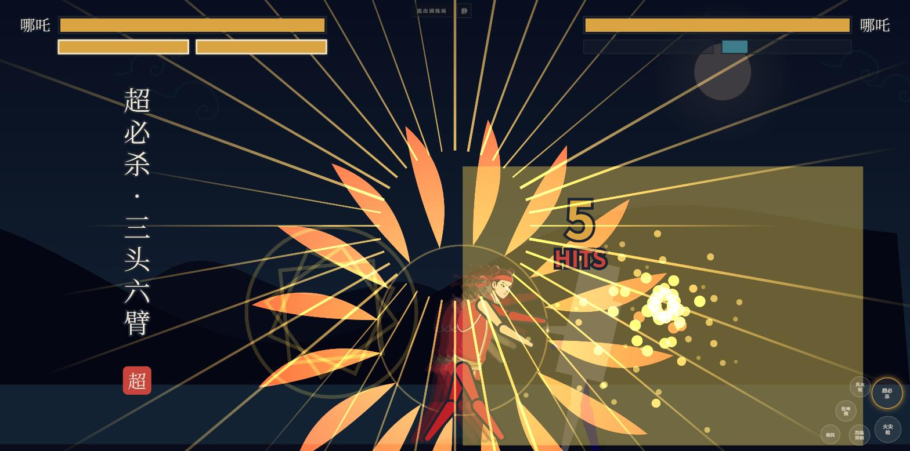

# 神仙打架

> 东方神话街机格斗 · 手机横屏即玩，无需下载安装

 

[▶ 在线试玩](https://fight.newzone.top/)

超必杀·三头六臂 —— 一次发动打 12 段，每段各自的火花与顿帧；右下角五键是手机横屏的右手操作区

打开网页就是一局横屏格斗：左手拇指按在哪，摇杆就长在哪，右手五键。连打三段、命中的瞬间取消进必杀、读准起手打出反击——招式名竖排落下、朱砂印盖上，背景乐是当场合成的五声音阶，逐关升调。十二位神仙妖怪各带八招和一对胜负台词，一人一景，抽到谁就打到谁家去。

## 支持范围

| 项 | 情况 |
| --- | --- |
| 设备 | 手机 / 平板 / 桌面浏览器，**横屏**（竖屏会提示转屏） |
| 操作 | 触屏（左手摇杆 + 右手五键），或键盘 |
| 安装 | 不需要；也可以「添加到主屏幕」当 App 用 |
| 网络 | 首次打开之后可以完全离线玩 |
| 账号与数据 | 不用注册，没有后端，什么都不上传。闯关记录（最远第几关 / 最快通关用时）只存在你自己浏览器里，清掉站点数据就没了 |

## 玩法

**六关连战**，单人闯关，三档难度（轻松 / 标准 / 修罗）。每关**三局两胜**，每回合 **60 秒**——时间到按剩余血量的比例判胜；比例完全相等、或者同一帧互相打死（双 KO），算平局，双方各记一个回合。

**前五关的对手从十二人名册里随机抽**（不重复、不打自己，也不会抽到牛魔王——他留给最后一关），**最后一关固定牛魔王**。种子在点下角色那一刻定，整趟不再变。

AI 逐关**看得更清**（见招拆招的概率 0.25→0.65，难度主要来自这里，不是数值墙），而且**打到残血会变凶**：血量掉到三成以下时进攻权重翻倍、后撤权重砍到三成半、气也不再存着。

标题页的**训练场**是不计胜负的陪练场（也可以用 `#training` 直接进）：双方都打不死，你的气常满，对手从十二人里随便挑，木桩分六挡——

- **木桩**：站着不动，练连段与取消路线
- **站防**：练下段，连击第二段是扫堂
- **蹲防**：练中段，跳起来打
- **跳入**：不停跳过来，练对空
- **压制**：贴身连打，练防御取消与投技解脱
- **对打**：会还手，练反击命中与抓空挥

## 操作

左手在屏幕内按下的地方即生成摇杆；右手**五键**。键盘同样可玩。

| 动作 | 触屏 | 键盘 |
| --- | --- | --- |
| 移动 / 蹲 | 摇杆左右 / 下 | `A` `D` / `S` |
| 跳 | 摇杆上 | `W` |
| 普攻（三段连击） | 普攻键 | `J` |
| 三个冷却技能 | **技能键 + 摇杆方向**（中立 / 推方向 / 推下 = 技一 / 二 / 三） | `U` `I` `O` |
| 大招 | 大招键 | `K` |
| 防御 | 防御键 | `L` |
| 吹飞攻击（KOF 的 CD 攻击） | 吹飞键 | `H`（或 `J`+`L` 同按） |

三个技能共用一颗键：按下的那一刻由摇杆方向决定放哪一招，键面实时写着当前会出的那一招——方向 + 按键本来就是格斗游戏的语法，要记的是一条规则而不是三个位置。

## 进阶系统

这些都是可选项，也是这个游戏「好玩」的来源——不是招式表更长，是选择更多。

| 系统 | 怎么做 | 作用 |
| --- | --- | --- |
| 跑 | 双击前进 | 速度 1.95×，可接跳 / 出招 / 急停转防御 |
| 后跳 | 双击后退 | 小跳退，起跳 6 帧无敌，躲起身压制 |
| 蹲防 / 站防 | 防御 + 下 / 防御 | **站防挡不住下段，蹲防挡不住跳跃攻击**。防御是一次读招，不是按住不放。蹲防受击框也矮一截，够高的招会整个从头上掠过 |
| 紧急回避 | 防御 + 左 / 右 | 低伏翻滚**从对手身体里穿过去**——换边、从版边压制里脱出。中段无敌、**收尾没有** |
| 小跳 / 大跳 | 轻点 / 按住 跳 | 小跳贴地压制，大跳滞空久、会被对空 |
| 先行输入 | 硬直 / 收招里提前按 | 出招键会被记住 6 帧，解除硬直时兑现——按早了不会白按 |
| 连段取消 | 普攻**命中后**再按普攻键 | 收招帧被下一段吃掉，三段连击才真的连得住；按晚了会掉段 |
| 反击命中 | 打在对手**出招的起手 / 判定帧**里 | 伤害 ×1.2、硬直 +6 帧，屏幕上弹「反击」 |
| 必杀取消 | 普攻**命中后**按技能 / 大招 | 连段深度的来源；空挥不能取消。**在挑空之前取消最赚**（见下） |
| 大招取消 | **必杀命中后**按大招 | 必杀也能接大招，不只普攻 |
| 受身 | 倒地 14 帧内**新按** 普攻键 或 防御键 | 52 帧干等缩到 20 帧。按住不放无效；大招 / 投技 / 吹飞打倒的**不能受身** |
| 防御取消 | 格挡硬直中按 普攻键（50 气） | 被压住时把对手顶开 |
| 投技 | **贴身**按普攻键（自动改出） | 破防用。倒地期间双方都打不到对方——"压上去"指的是贴住等他起身抢主动权，不是打地上的人 |
| 投技解脱 | 被投前 12 帧内**新按** 普攻键 | 双方分开，都不掉血。按住不放无效 |
| 蓄气 / 爆气 | 按住 防御 + 大招键 | 远处按是原地攒气；有 50 气时按下即**爆气**——顶开贴身的对手 + 8 帧无敌，之后 5 秒伤害 ×1.25 |

连段有路线之分，不是按满就完事。大招发动带**暗転**（起手期间对手一并冻结），所以从普攻取消进大招接得上——但取消的时机决定收益：

| 路线 | 结果 |
| --- | --- |
| 纯连打三段 | 28-35 伤 |
| 第二段取消进大招 | 16 段 / 61-71 伤，满血的三分之一 |
| **第二段接必杀、必杀再接大招** | **17 段 / 77-89 伤**，满血的四成——满气最赚的一套 |
| 第三段（挑空）之后再放 | 7 段 / 40 伤——人已经被打飞，大招多半落空 |

两条天花板：**技能之间不能互相取消**（只有普攻起手才接得上必杀），**大招也不能在自己的演出途中被下一记大招顶掉**。

每个角色的 **n2 是下段扫堂**（连击第二段），**跳跃攻击是中段**——三段连击打出去，对手光按防御挡不住，得跟着切上下段；而你跳一下再落地打下段，就能骗过他的猜测。**吹飞攻击**（KOF 的 CD 攻击）是一记通用重击，把对手打飞、拉开距离并必定击倒，用来在被贴身时强行脱身，或者把人推到版边开始压制。

**倒不倒是招式的属性，不是伤害高低。** 每人只有一记必杀打得倒人，加上 n3 收招、两档大招、投技与吹飞；其余必杀打完对手还站着，攻势可以接着走。击倒又分两类：**软击倒**（那记击倒必杀、n3 收招）可以受身，挨打方有出口；**硬直击倒**（大招、投技、吹飞）必须躺满，攻方拿到主动权。

大招按气槽分两档：气 ≥50 出**奥义**，=100 出**超必杀**。每一档又有长短两版——**这一击能 KO** 就走十秒完整演出（影院黑边、十五拍镜头调度、连打一路把对手逼到版边、终结爆发），**打不死**就是三秒短版。

## 角色

十二位，各有一景：**哪吒 · 孙悟空 · 二郎神 · 牛魔王 · 红孩儿 · 铁扇公主 · 白骨精 · 后羿 · 雷震子 · 钟馗 · 刑天 · 猪八戒**。每人 8 招——三段普攻连击 + 三个冷却技能 + 两档大招，外加一对胜负台词。

加一个新角色就是新建一个文件，本地怎么跑起来、这个项目在测试上栽过哪些坑，都在 [DEVELOPMENT.md](DEVELOPMENT.md)。

## 已知问题

- **判定框比兵器画得远。** 最扎眼的是 n3（连击第三段）：判定框比刃尖多伸出 40~60px，接近一个身位，会出现"看着没碰到却算打中"。已经逐招量过，数据与修法见 [DEVELOPMENT.md](DEVELOPMENT.md)。
- **只有单人闯关和训练场**，没有联机对战，也没有本地双人。

## License

MIT，见 [LICENSE](LICENSE)。

代码之外有两处第三方素材，各自的授权与本项目不同：

- **字体** `public/fonts/ShenxianSerif.woff2` —— Noto Serif SC 的子集，SIL Open Font License 1.1，版权归 Google Inc.，许可文件见 `public/fonts/OFL.txt`
- **两枚采样音效** `public/sfx/*.ogg` —— 取自 [Kenney](https://kenney.nl) 的 `Impact Sounds` 素材包，CC0（公有领域），来源与 sha256 记在 `public/sfx/SOURCE.md`

---

## 关于 365 开源计划

[365 开源计划](https://github.com/rockbenben/365opensource) 的第 **#034** 个项目——一个人 + AI，一年 300+ 个开源项目。

[提交你的需求 →](https://365.aishort.top/) · [Discord](https://discord.gg/PZTQfJ4GjX) · [Telegram](https://t.me/aishort_top)
